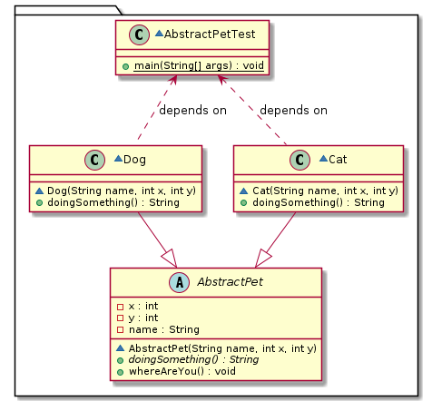
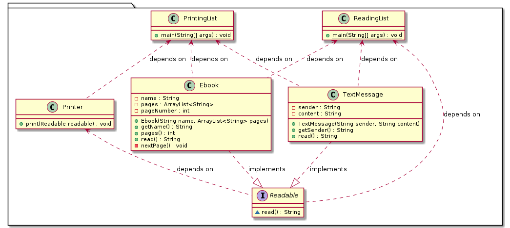
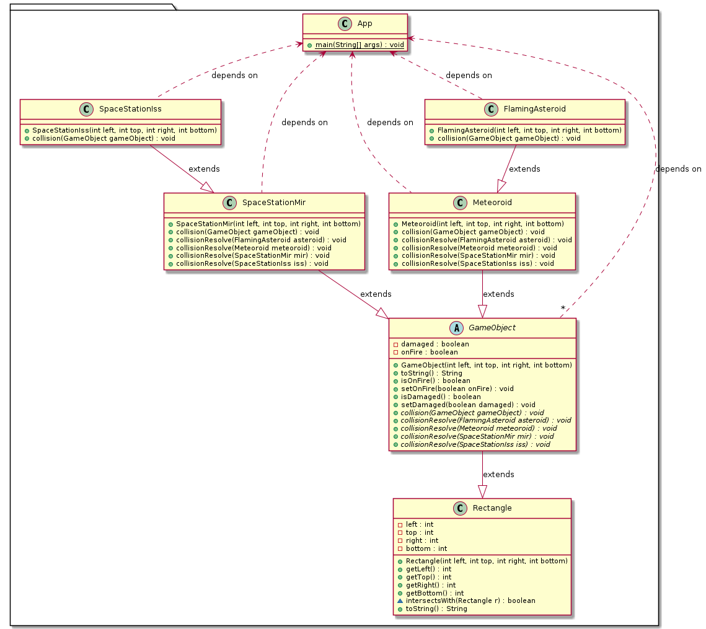

# Prática: Missão (im)possível?

Nesta prática, são fornecidos vários códigos em Java que empregam recursos da programação orientada a objetos.

Você e sua dupla precisam estudá-los para completar "missões" que serão sorteadas em aula.
Essas "missões" podem ser questões teóricas ou tarefas práticas. Por exemplo: "Quais os construtores definidos na classe X?", "Mostre para a turma como executar o código na pasta X", "Qual método será chamado na linha Y", "Adicione um construtor sem argumentos na classe Z", etc.

# Códigos

Fontes: [src/abstractpet](src/abstractpet)

Fontes: [src/readable](src/readable)

Fontes: [src/doubledispatch](src/doubledispatch)

----
Sorteio de duplas com um destes programas: https://github.com/MichaelCStrahl/create-groups ou https://github.com/Argschadt/formar-grupos ou https://github.com/gabriel-caetano/group-generator ou https://github.com/eduardogeh/sorteioGrupos (lista de nomes [aqui](../java02/src/ParaGroups.java))

<!-- https://script.google.com/macros/s/AKfycby-XhtamWS5gLb_4FXFSMvAKMeXskcZQJxp468WQZSDDwWx_0YVo2VccixVPWDCGUOo/exec?action=get -->

