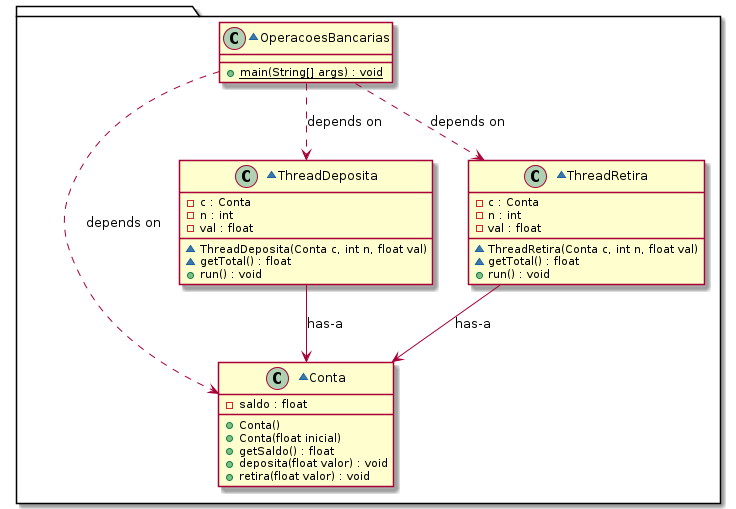

<p align="left"><a href="../README.md"><< Reiniciar</a> | <a href="README01.md">Anterior</a></p>

## Operações Bancárias




1. Baixe o programa [OperacoesBancarias.java](../src/sharedaccount/OperacoesBancarias.java) e analise seu código. Veja que foi usada a palavra-chave `synchronized`, explicada nos slides. Execute o programa algumas vezes e verifique se o resultado é sempre correto (com saldo inicial de 100, 10 depósitos de 100 e 5 retiradas de 50, o saldo final deve ser de 850).


2. Remova os termos `synchronized` dos métodos `deposita` e `retira`. Recompile o programa e execute-o algumas vezes. Verifique se ocorrem execuções com resultado incorreto.
É possível que você execute o programa algumas vezes e não obtenha um resultado incorreto. **Isso não quer dizer que o programa esteja correto!**


4. Para você não se cansar de executar o programa várias vezes :smiley:, baixe o script [repete-execucao.sh](../src/sharedaccount/repete-execucao.sh), que repete a execução de um programa várias vezes e para quando os resultados forem diferentes.
Por exemplo, para repetir a execução 20 vezes, execute no terminal:
   ```
   bash repete-execucao.sh 20 java OperacoesBancarias
   ```

4. Capture uma imagem de alguma execução com resultado correto e outra com resultado incorreto. Entregue estas imagens no repositório de entrega, dentro de uma pasta nomeada `sharedaccount` (exatamente desta forma, só em minúsculas).


<p align="right"><a href="README03.md">Vamos adiante... >></a> </p>
