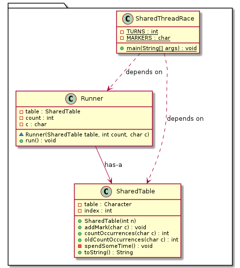

<a href="../README.md"><< Reiniciar</a> | <a href="README02.md">Anterior</a>

## Tabela Compartilhada

1. Baixe o código da pasta [sharedtable](../src/sharedtable), que contém os arquivos para os próximos exercícios (isso corresponde ao exemplo no final dos slides).

2. LEIA ISTO AQUI ANTES: Neste programa, **3 threads** `Runner`s atualizam concorrentemente uma **tabela compartilhada**, inserindo caracteres A, B ou C na próxima posição livre. Cada thread insere 20 caracteres, portanto, no final de cada rodada, a contagem de caracteres no array deve ser: `A=20 B=20 C=20`.

3. Execute o programa várias vezes e observe como a ordem de execução das threads pode variar. Além disso, observe que o resultado final nem sempre é correto (há uma **condição de corrida** que leva a uma **inconsistência de dados**).

4. Corrija o programa, utilizando um método `synchronized`. Para isso, identifique: 1) a classe que representa o objeto compartilhado e 2) o método que deve ser executado em exclusão mútua. 

5. Re-execute o programa algumas vezes para verificar a mudança no comportamento das execuções.

<a href="README04.md">Vamos adiante... >></a> 

